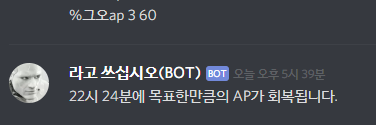

# Discord.py 관련 함수들 출력 형태

| 함수 이름                                                    | 출력 스크린샷         |
| ------------------------------------------------------------ | --------------------- |
| calc.fgo_ap_recover_calc(...) `해당 함수를 이용하여 문자열을 만든 것입니다.` |   |
| calc.fgo_req_exp_out_discord(...)                            |   |
| calc.np_calc_discord(...)                                    |   |
| gacha.gacha_simulate(...)                                    |   |
| gacha.gacha_run(...)                                         |   |
| servstat.out_discord(...)                                    |   |
| view_pickup.search_pickup_discord(...)                       |   |
| view_pickup.call_discord(...) `인자값이 없을 때`        |   |
| view_pickup.call_discord(...) `인자로 년도 기호를 입력` |   |
| view_pickup.call_discord(...) `인자로 년도 기호와 페이지를 입력` |  |
| view_pickup.call_discord(...) `인자로 픽업 id를 입력`   |  |

